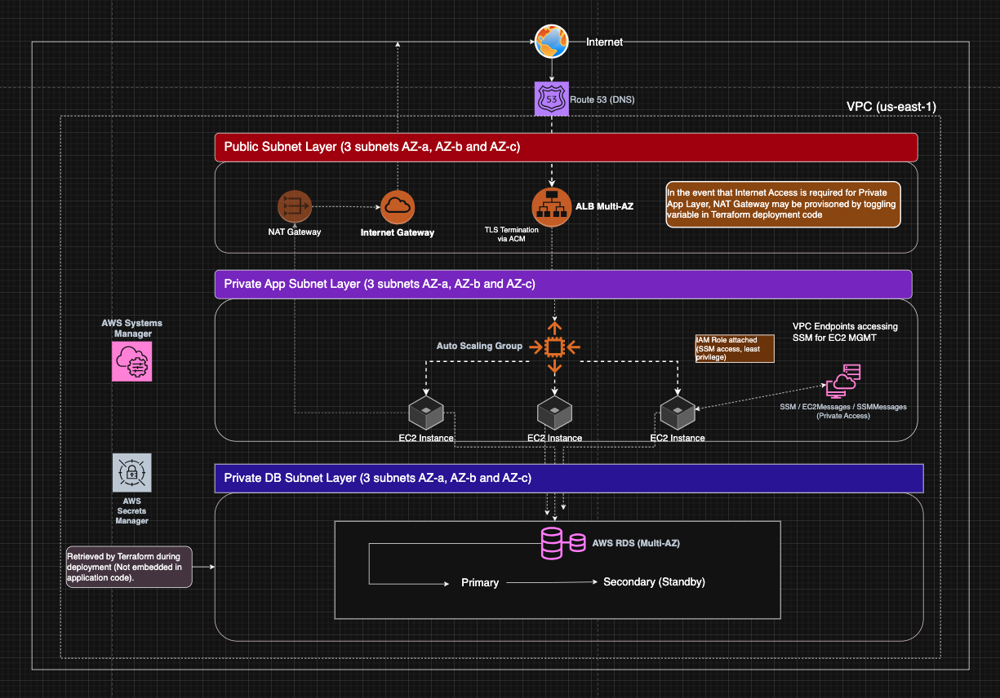

# Terraform AWS 3-Tier VPC Architecture (High Availability, Production-Style)

## Overview

This repository demonstrates a production-style, highly available 3-tier
architecture on AWS using Terraform. The design emphasizes modularity,
security, cost-awareness, and alignment with real-world infrastructure
patterns.

This project has been iteratively enhanced to incorporate
production-grade practices such as immutable infrastructure, controlled
CI/CD workflows, and secure secret management.

------------------------------------------------------------------------

## Architecture

High-level request flow:

Internet → Application Load Balancer → EC2 Auto Scaling Group → Amazon
RDS

Core characteristics:

-   Region: us-east-1
-   3 Availability Zones for high availability
-   9 subnets:
    -   3 Public (ALB)
    -   3 Private Application
    -   3 Private Database

------------------------------------------------------------------------

## Architecture Diagram

------------------------------------------------------------------------

## Key Design Decisions (The "Why")

### 1. Three Availability Zones

Chosen to demonstrate true high availability and fault tolerance beyond
basic two-AZ designs.

### 2. NAT-less Architecture (Default)

NAT Gateway is disabled to reduce cost. VPC Interface Endpoints are used
for SSM access.

Tradeoff: - Lower cost - No outbound internet access from private
subnets - Requires alternative approach for software installation

### 3. Immutable Infrastructure via AMI

Application dependencies (Apache) are pre-installed in a custom AMI
instead of installed at boot.

Why: - Eliminates runtime dependency on internet access - Faster and
deterministic instance boot - Aligns with production-grade
infrastructure patterns

### 4. Private Application Tier

EC2 instances are not publicly accessible and are managed via AWS
Systems Manager Session Manager.

Why: - Eliminates SSH exposure - Improves security posture

### 5. Layered Security Groups

Traffic is strictly controlled:

-   ALB accepts traffic from the internet
-   EC2 accepts traffic only from ALB
-   RDS accepts traffic only from EC2

### 6. Modular Terraform Design

Infrastructure is split into reusable modules:

-   vpc
-   subnets
-   alb
-   asg
-   rds
-   security-groups
-   endpoints
-   secrets

### 7. Secrets Management

Database credentials are stored in AWS Secrets Manager.

Why: - Prevents credential exposure - Aligns with secure design
practices

------------------------------------------------------------------------

## Project Structure

    modules/
      vpc/
      subnets/
      alb/
      asg/
      rds/
      security-groups/
      endpoints/
      secrets/

    environments/
      dev/
      prod/

    global/
      backend-bootstrap/

------------------------------------------------------------------------

## Deployment Steps

    git clone <repo-url>
    cd terraform-aws-3tier-vpc-ha

    cd global/backend-bootstrap
    terraform init
    terraform apply

    cd ../../environments/dev
    terraform init
    terraform plan
    terraform apply

Access the application via the ALB DNS output.

------------------------------------------------------------------------

## Teardown Steps

### CLI

    cd environments/dev
    terraform destroy

### CI/CD Workflow

A controlled destroy workflow is implemented using GitHub Actions with:

-   Manual trigger
-   Explicit confirmation input
-   Environment scoping

------------------------------------------------------------------------

## CI/CD

GitHub Actions pipeline includes:

-   terraform fmt
-   terraform validate
-   terraform plan
-   Controlled apply workflow
-   Controlled destroy workflow

Authentication is handled via OIDC (no static credentials).

------------------------------------------------------------------------

## Cost Considerations

-   NAT Gateway removed (\~\$30/month savings)
-   t2.micro EC2 instances
-   db.t3.micro RDS
-   VPC Endpoints used instead of NAT

Tradeoff: - Reduced cost vs limited outbound connectivity

------------------------------------------------------------------------

## Security Considerations

-   No public EC2 instances
-   No SSH access (SSM only)
-   Database is private
-   Strict security group boundaries
-   Secrets stored in AWS Secrets Manager
-   IAM roles used instead of access keys
-   Remote state stored in S3 with DynamoDB locking

------------------------------------------------------------------------

## Lessons Learned

-   Terraform state locks must be handled carefully (force-unlock when
    necessary)
-   AWS Secrets Manager retains deleted secrets for a recovery window
-   VPC teardown may fail due to dependency chains (ENIs, SGs, IGW)
-   Resources created outside Terraform can cause drift
-   AWS infrastructure deletion is not always immediate (eventual
    consistency)

------------------------------------------------------------------------

## Future Improvements

-   Automate AMI creation using Packer
-   Add HTTPS (ACM + ALB or CloudFront)
-   Implement blue/green deployments
-   Add monitoring and alerting (CloudWatch)
-   Enable secret rotation

------------------------------------------------------------------------

## Author

Heath Smith AWS Certified Solutions Architect -- Associate
