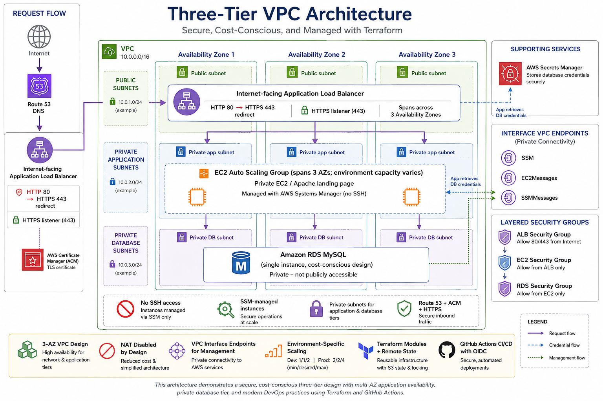
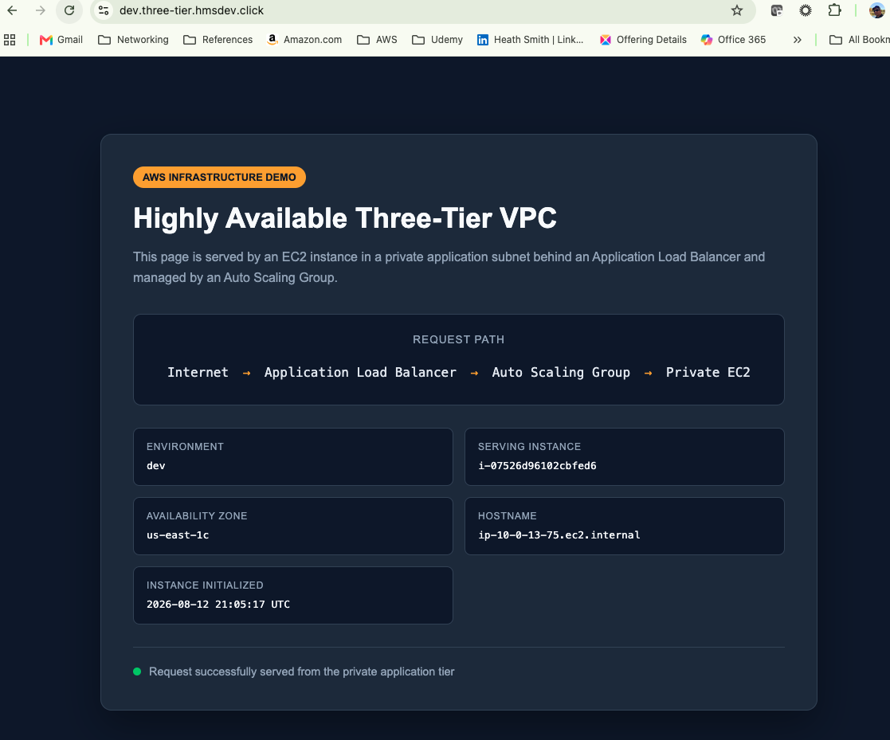

# Terraform AWS Three-Tier VPC Architecture

A production-style three-tier AWS infrastructure project built with Terraform. The architecture demonstrates three-Availability-Zone network segmentation, HTTPS load balancing, private application and database tiers, environment-specific Auto Scaling, Systems Manager administration, remote Terraform state, and controlled CI/CD through GitHub Actions and AWS OIDC.

The design intentionally balances production-oriented AWS patterns with portfolio cost control. The network and application tiers are distributed across three Availability Zones, while the RDS database remains a single instance rather than Multi-AZ.

## Architecture



The VPC is divided across three Availability Zones with dedicated public, private application, and private database subnets.

The primary infrastructure tiers are:

- **Web tier:** internet-facing Application Load Balancer across public subnets
- **Application tier:** EC2 Auto Scaling Group across private application subnets
- **Data tier:** private Amazon RDS for MySQL instance in the database subnet group

Supporting services include Route 53, AWS Certificate Manager, AWS Secrets Manager, AWS Systems Manager, interface VPC endpoints, IAM, and layered security groups.

## Application Preview



The portfolio landing page is served by Apache from EC2 instances in the private application tier behind the Application Load Balancer. It displays runtime infrastructure evidence such as the environment, serving instance ID, Availability Zone, hostname, and initialization time.

## Current Request Path

The deployed demonstration page follows this request path:

```text
Internet
   │
   ▼
Route 53
   │
   ▼
Application Load Balancer
HTTP 80 → HTTPS 443
   │
   ▼
Auto Scaling Group
   │
   ▼
Private EC2 / Apache
```

Amazon RDS is provisioned as the private data tier of the three-tier architecture, but the current static portfolio landing page does not query the database during the web request path.

## Key Design Decisions

### Three-Availability-Zone network design

The VPC uses three Availability Zones and nine subnets:

```text
Availability Zone 1
├── Public subnet
├── Private application subnet
└── Private database subnet

Availability Zone 2
├── Public subnet
├── Private application subnet
└── Private database subnet

Availability Zone 3
├── Public subnet
├── Private application subnet
└── Private database subnet
```

The Application Load Balancer spans the public subnets, while the Auto Scaling Group can place application instances across the private application subnets.

### Environment-specific Auto Scaling

Application capacity is deliberately different between environments.

```text
Environment   Minimum   Desired   Maximum
dev               1         1         2
prod              2         2         4
```

Production therefore maintains multiple application instances, while development uses lower baseline capacity to reduce portfolio cost.

### NAT-less private application tier

NAT Gateway is disabled in both environments.

Instead of routing private EC2 administration traffic through a NAT Gateway, the VPC provides interface endpoints for:

- Systems Manager (`ssm`)
- EC2 Messages (`ec2messages`)
- Systems Manager Messages (`ssmmessages`)

This reduces reliance on general outbound internet connectivity while still supporting Systems Manager administration.

The design is a cost and connectivity tradeoff rather than a claim that interface endpoints are universally cheaper than NAT. Interface endpoints have their own hourly and data-processing costs.

### Systems Manager instead of SSH

Application instances do not require inbound SSH access.

The EC2 launch template uses an IAM instance profile with the AWS-managed `AmazonSSMManagedInstanceCore` policy, allowing administration through AWS Systems Manager Session Manager.

### Immutable application dependency

Apache is already installed in the AMI used by the Auto Scaling Group.

Instance user data performs lightweight environment initialization rather than downloading the web server at boot. It starts Apache and generates the portfolio landing page using runtime instance metadata obtained through IMDSv2.

### Layered security groups

Traffic is restricted by tier:

```text
Internet
   │
   ▼
ALB security group
   │
   ▼
EC2 security group
   │
   ▼
RDS security group
```

- ALB accepts HTTP and HTTPS from the internet.
- EC2 application ingress is allowed from the ALB security group.
- RDS ingress is allowed from the EC2 security group.
- Interface endpoints accept HTTPS traffic from within the VPC.

### HTTPS with Route 53 and ACM

Both environments use custom DNS names:

```text
dev   → https://dev.three-tier.hmsdev.click
prod  → https://three-tier.hmsdev.click
```

Route 53 aliases the application hostname to the Application Load Balancer.

AWS Certificate Manager provisions and DNS-validates the TLS certificate. The ALB redirects HTTP port 80 traffic to HTTPS port 443 and uses:

```text
ELBSecurityPolicy-TLS13-1-2-2021-06
```

for the HTTPS listener.

### Private RDS data tier

Amazon RDS for MySQL is deployed into the private database subnet group with:

```text
publicly_accessible = false
```

The current database uses a single `db.t3.micro` instance rather than Multi-AZ deployment. This is an intentional portfolio cost tradeoff and means the database tier should not be interpreted as highly available.

### Secrets Manager credentials

Database credentials are generated through AWS Secrets Manager and supplied to RDS without maintaining a plaintext password in the Terraform configuration.

The project uses Terraform write-only secret/password attributes where supported, reducing exposure of the database password through normal Terraform resource state.

Development secrets can be deleted immediately during teardown, while production uses a 30-day recovery window.

## Terraform Architecture

The active environment configurations compose reusable Terraform modules:

```text
modules/
├── acm/
├── alb/
├── asg/
├── dns/
├── endpoints/
├── rds/
├── secrets/
├── security-groups/
├── subnets/
└── vpc/
```

Development and production are separate Terraform roots:

```text
environments/
├── dev/
└── prod/
```

Both environments currently require:

```text
Terraform >= 1.15.0
AWS provider ~> 6.40
```

Dependency lockfiles are committed separately for each environment.

## Remote State

Terraform state is stored remotely in the portfolio AWS account using an encrypted S3 backend.

```text
hms-terraform-state-portfolio
├── 3tier-vpc/dev/terraform.tfstate
└── 3tier-vpc/prod/terraform.tfstate
```

Native S3 state locking is enabled with:

```hcl
use_lockfile = true
```

Development and production therefore maintain independent remote state and locking.

## CI/CD with GitHub Actions

Terraform operations are automated through GitHub Actions using AWS OIDC authentication rather than long-lived AWS access keys.

A reusable composite action performs the common environment preparation steps:

```text
AWS OIDC authentication
        │
        ▼
Terraform 1.15.3 setup
        │
        ▼
terraform init
        │
        ├── terraform fmt -check -recursive
        └── terraform validate
```

### Pull request planning

The Terraform Plan workflow detects which part of the repository changed.

- changes under `environments/dev/` plan DEV;
- changes under `environments/prod/` plan PROD;
- changes to shared modules or Terraform workflow/action code plan both environments.

Each applicable environment receives its own Terraform plan, and the resulting plan is posted to the pull request for review.

### Controlled apply

Infrastructure deployment is performed through a manually triggered workflow with explicit DEV or PROD environment selection.

The workflow:

1. authenticates to AWS through OIDC;
2. initializes and validates the selected Terraform environment;
3. performs environment-specific operational handling where required;
4. creates a saved Terraform plan; and
5. applies that exact saved plan.

For PROD, the workflow also checks whether the database credential secret already exists or is scheduled for deletion. If necessary, it restores the secret and imports it back into Terraform state before planning.

### Controlled destroy

Destruction uses a two-stage workflow rather than issuing an immediate `terraform destroy -auto-approve`.

The workflow:

1. requires the user to type `destroy`;
2. creates a saved destroy plan;
3. renders the plan into the GitHub Actions job summary;
4. uploads the saved plan as a short-lived workflow artifact;
5. downloads that reviewed artifact in the execution job; and
6. applies the reviewed destroy plan.

This separates destructive planning from execution and makes the intended resource removal visible before it is applied.

## Security

Security controls demonstrated by the project include:

- private EC2 application instances;
- no inbound SSH requirement;
- Systems Manager administration through IAM and VPC endpoints;
- private RDS database access;
- layered ALB → EC2 → RDS security-group boundaries;
- HTTPS ingress through ACM and the Application Load Balancer;
- HTTP-to-HTTPS redirection;
- Route 53 DNS aliases;
- database credentials stored in AWS Secrets Manager;
- IAM roles instead of EC2 access keys;
- GitHub Actions OIDC instead of stored AWS deployment credentials;
- remote Terraform state in encrypted S3;
- native S3 Terraform state locking; and
- independent DEV and PROD Terraform state.

## Repository Structure

```text
.
├── .github/
│   ├── actions/
│   │   └── terraform-setup/
│   └── workflows/
│       ├── terraform-plan.yml
│       ├── terraform-apply.yml
│       └── terraform-destroy.yml
├── assets/
│   └── three-tier-vpc-architecture.png
├── docs/
│   └── screenshots/
│       └── three-tier-vpc-frontend.png
├── environments/
│   ├── dev/
│   └── prod/
├── modules/
│   ├── acm/
│   ├── alb/
│   ├── asg/
│   ├── dns/
│   ├── endpoints/
│   ├── rds/
│   ├── secrets/
│   ├── security-groups/
│   ├── subnets/
│   └── vpc/
└── README.md
```

## Deployment

GitHub Actions is the preferred deployment path because it exercises the repository's OIDC authentication and controlled Terraform lifecycle.

Infrastructure can also be planned locally.

For development:

```bash
cd environments/dev
AWS_PROFILE=portfolio terraform init
AWS_PROFILE=portfolio terraform validate
AWS_PROFILE=portfolio terraform plan
```

For production:

```bash
cd environments/prod
AWS_PROFILE=portfolio terraform init
AWS_PROFILE=portfolio terraform validate
AWS_PROFILE=portfolio terraform plan
```

Review Terraform plans before applying infrastructure changes.

## Deployment Endpoints

When the corresponding environment is deployed:

- **Development:** https://dev.three-tier.hmsdev.click
- **Production:** https://three-tier.hmsdev.click

> These are on-demand portfolio environments and may be intentionally offline when not in use to control AWS costs.

## Teardown

The preferred teardown path is the controlled GitHub Actions Destroy workflow.

For local administrative review, a destroy plan can also be generated from an environment root:

```bash
AWS_PROFILE=portfolio terraform plan -destroy
```

Review the destroy plan before execution.

## Validation

The infrastructure lifecycle has been exercised through Terraform planning, controlled deployment, functional application testing, and controlled destruction.

Validation has included:

- Terraform initialization and validation;
- pull-request Terraform planning;
- controlled GitHub Actions deployment;
- Route 53 DNS resolution;
- ACM certificate validation;
- HTTPS access through the Application Load Balancer;
- HTTP-to-HTTPS redirection;
- ALB target health verification;
- application delivery from private EC2 instances;
- Auto Scaling Group operation;
- runtime verification of serving instance and Availability Zone information;
- Systems Manager-based private instance administration;
- private RDS provisioning;
- Secrets Manager credential management;
- Terraform convergence testing; and
- controlled destroy-plan review and execution.

## Cost Considerations

The project intentionally balances architectural realism with portfolio cost control.

Major cost considerations include:

- EC2 `t3.micro` instances;
- RDS `db.t3.micro`;
- Application Load Balancer usage;
- interface VPC endpoint hourly and data-processing charges;
- Route 53 DNS usage;
- Secrets Manager;
- S3 remote-state storage; and
- standard AWS data-transfer charges.

NAT Gateway is disabled by design, avoiding NAT Gateway charges but also removing general outbound internet access from the private tiers. Interface endpoints provide private management connectivity for the AWS Systems Manager services used by the application tier.

DEV also uses lower Auto Scaling capacity than PROD to reduce cost when demonstrating the architecture.

## Lessons Learned

This project reinforced several operational behaviors that matter when managing AWS infrastructure with Terraform:

- remote Terraform state and locking require disciplined lifecycle management;
- Secrets Manager deletion recovery can affect repeated destroy/redeploy workflows;
- VPC teardown can be delayed by dependency chains such as ENIs and security groups;
- AWS resource deletion is not always immediate because of eventual consistency;
- resources created or restored outside Terraform may require state reconciliation; and
- cost optimization can intentionally trade some availability or connectivity characteristics for lower operating cost.

## Future Improvements

Potential extensions include:

- enable Multi-AZ RDS for full database-tier availability;
- automate AMI creation with Packer;
- add target-tracking or other Auto Scaling policies;
- add CloudWatch dashboards, alarms, and application monitoring;
- enable automated Secrets Manager rotation;
- add database-backed application behavior to exercise the complete request path; and
- explore blue/green application deployment patterns.

## Author

Heath Smith
